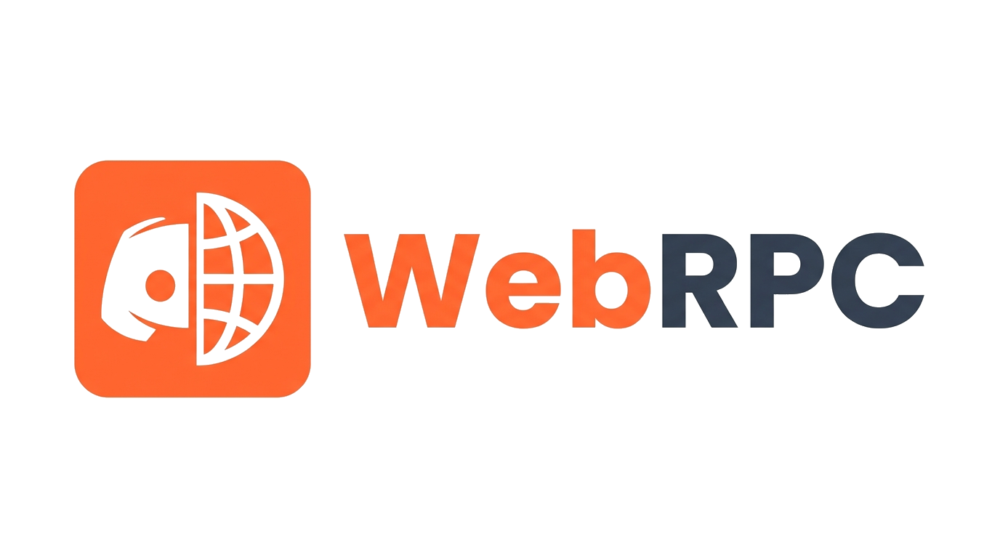
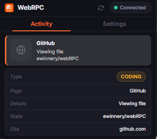
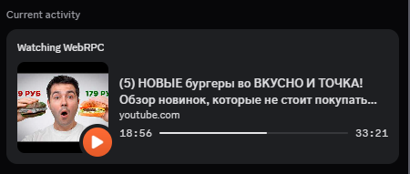

<p align="center">
  
</p>

<h1 align="center">WebRPC</h1>

<p align="center">
  Браузерное расширение и C++ клиент для отображения активности из браузера в Discord Rich Presence.
</p>

<p align="center">
  <a href="https://developer.chrome.com/docs/extensions/mv3/intro/"></a>
  <a href="https://isocpp.org/"></a>
  <a href="https://discord.com"></a>
  <a href="LICENSE"></a>
</p>

---

## Описание

WebRPC состоит из браузерного расширения и фонового C++ клиента. Расширение считывает текущую вкладку (видео на YouTube, треки в Spotify, стримы на Twitch, страницы GitHub и т.д.) и передает данные клиенту через WebSocket, который затем обновляет ваш статус в Discord.

## Скриншоты

| Расширение | Статус в Discord |
| :---: | :---: |
|  |  |

---

## Особенности

- **Поддержка медиаплееров:** Автоматически показывает название видео или трека, статус воспроизведения (Play/Pause) и таймкоды (YouTube, Twitch, Netflix, Spotify и др.).
- **Поддержка веб-сайтов:** Отображает сайт и его логотип (GitHub, Reddit, Twitter/X и др.).
- **Настройки приватности:** Можно скрыть название страницы, отключить кнопки или выбрать стиль иконок в меню расширения.
- **Низкое потребление ресурсов:** Фоновый C++ клиент работает в системном трее и потребляет минимум памяти.

---

## Установка и запуск

### 1. Запуск C++ клиента
1. Убедитесь, что десктопный Discord запущен.
2. Запустите `webRPC.exe`.

*Сборка из исходников (опционально):*
```bash
cd "client src"
mkdir build && cd build
cmake ..
cmake --build . --config Release
```

### 2. Установка расширения
1. Откройте `chrome://extensions/` в браузере.
2. Включите **Режим разработчика** (вверху справа).
3. Нажмите **Загрузить распакованное расширение** и выберите папку `extension`.

---

## Решение проблем

- **Статус не появляется в Discord:** Убедитесь, что запущен десктопный Discord и в его настройках (*Конфиденциальность активности*) включена опция *«Отображать текущую активность в статусе»*.
- **Расширение показывает Disconnected:** Проверьте, запущен ли `webRPC.exe` (клиент использует локальный порт `8765` - убедитесь что не занят либо смените в настройках.).

---

## Лицензия
Проект полностью опенсурс.
[GNU GPL-3.0](LICENSE)
